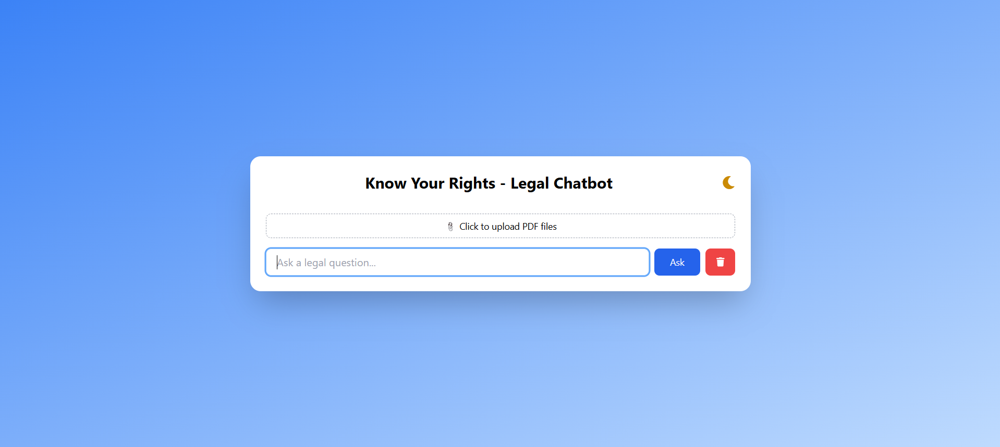
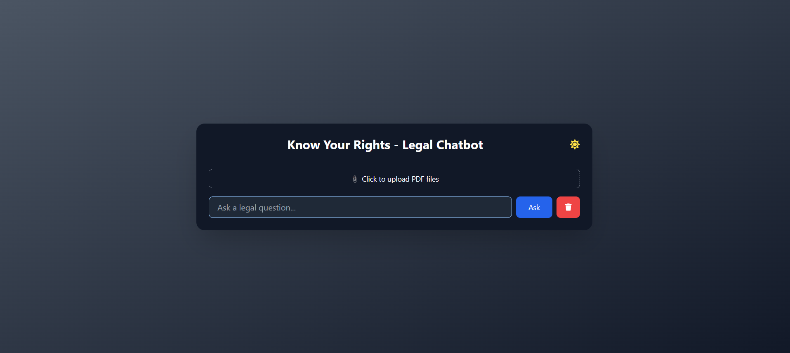
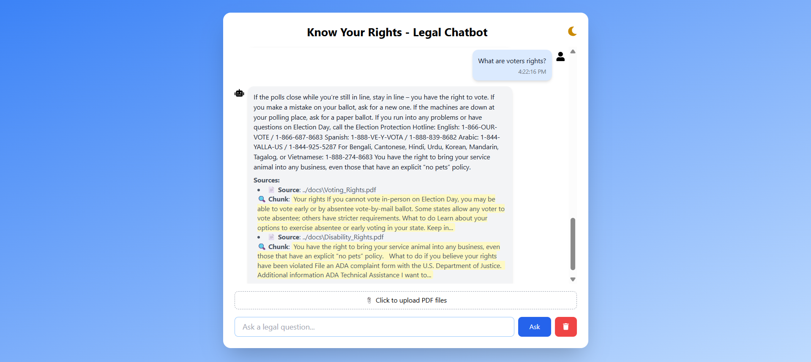
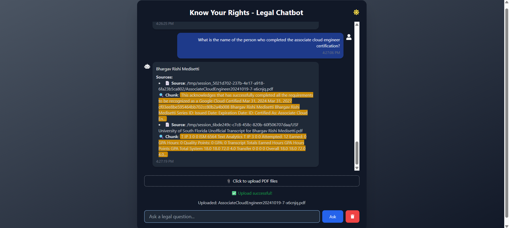

# Know Your Rights – Legal Chatbot


  
  


---

Legal jargon can be overwhelming. Our chatbot simplifies it.

**Know Your Rights** is a **Retrieval-Augmented Generation (RAG)** based legal assistant that answers user questions about legal rights. It combines the power of a language model (Flan-T5) with relevant context from government PDFs, ACLU documents, or any uploaded file, ensuring grounded and factual responses.

---

## How It Works

- The app uses **RAG (Retrieval-Augmented Generation)** architecture.
- Uploaded legal PDFs are parsed and split into smaller chunks.
- These chunks are embedded using **BAAI/bge-small-en** and stored in a FAISS vector store.
- When a question is asked:
  - Relevant document chunks are retrieved based on vector similarity.
  - The question and context are passed to **Flan-T5**, which generates a final answer.

---

## Screenshots

### Homepage (Initial View)



### Legal Question Answering



---

## Features

- Natural Language Legal Q&A  
- Multi-file PDF Uploads for Context  
- FAISS Vectorstore + Hugging Face Embeddings  
- Serverless Deploy (Render + Hugging Face)  
- Light/Dark Mode  
- Upload validation + session caching

---

## Tech Stack

**Backend**:  
- **FastAPI**  
- **LangChain** for chaining components together and RAG pipeline
- **FAISS** for fast vector similarity search
- **Flan-T5 (Hugging Face)** as the language model for generation
- **PyMuPDF** for extracting content from uploaded PDFs


**Frontend**:  
- React + Vite  
- TailwindCSS  
- Axios  

**Deploy**:  
- Backend → Hugging Face Spaces  
- Frontend → Render

---

## Run Locally

### Backend
```bash
cd backend
pip install -r requirements.txt
python main.py
```

### Frontend
```bash
cd frontend
npm install
npm run dev
```


## Use Cases

- Legal rights awareness for students, immigrants, or tenants  
- Document comprehension for law clinics or journalists  
- Prototype for scalable legal tech solutions  
